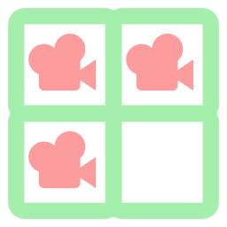

# Camera Monitor

Godot Engine plugin to inspect multiple cameras' preview.

- When select a camera, you can see its preview under the inspector.

- In the monitor you can attach selected camera or current view of the editor's camera.

## Install

1. Clone or download this repository, move folder `camera-monitor` to your project's `addons` folder.

> You can search and install `Camera Monitor` via AssetLib. When installing, you should only select the files in `addons` folder.

2. To enable the plugin, open `Project > Project Settings > Plugins`, find `Camera Monitor` in plugins list, check `Enabled` checkbox. A dock named `Camera` will appear on the right.

## License

MIT
